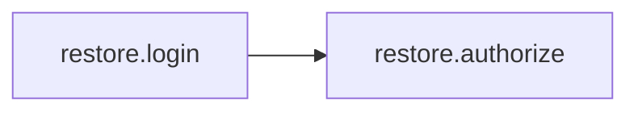
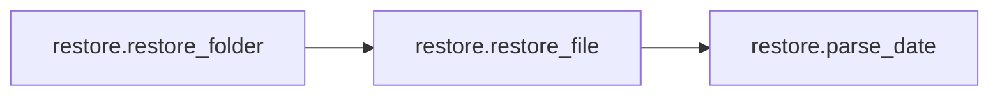
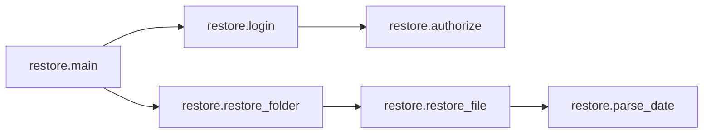
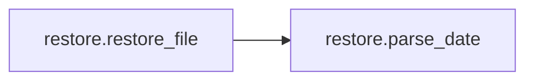

# Key Objects

[_Documentation generated by Documatic_](https://www.documatic.com)

<!---Documatic-section-restore.login-start--->
## restore.login

<!---Documatic-section-login-start--->


### Object Calls

* restore.authorize

<!---Documatic-block-restore.login-start--->
<details>
	<summary><code>restore.login</code> code snippet</summary>

```python
def login(token_save_path):
    if os.path.exists(token_save_path):
        with open(token_save_path) as token_file:
            access_token = token_file.read()
    else:
        access_token = authorize()
        with open(token_save_path, 'w') as token_file:
            token_file.write(access_token)
    return dropbox.client.DropboxClient(access_token)
```
</details>
<!---Documatic-block-restore.login-end--->
<!---Documatic-section-login-end--->

# #
<!---Documatic-section-restore.login-end--->

<!---Documatic-section-restore.restore_folder-start--->
## restore.restore_folder

<!---Documatic-section-restore_folder-start--->


### Object Calls

* restore.restore_file

<!---Documatic-block-restore.restore_folder-start--->
<details>
	<summary><code>restore.restore_folder</code> code snippet</summary>

```python
def restore_folder(client, path, cutoff_datetime, verbose=False):
    if verbose:
        print('Restoring folder: ' + path.encode('utf8'))
    try:
        folder = client.metadata(path.encode('utf8'), list=True, include_deleted=True)
    except dropbox.rest.ErrorResponse as e:
        print(str(e))
        print(HELP_MESSAGE)
        return
    for item in folder.get('contents', []):
        if item.get('is_dir', False):
            restore_folder(client, item['path'], cutoff_datetime, verbose)
        else:
            restore_file(client, item['path'], cutoff_datetime, item.get('is_deleted', False), verbose)
        time.sleep(DELAY)
```
</details>
<!---Documatic-block-restore.restore_folder-end--->
<!---Documatic-section-restore_folder-end--->

# #
<!---Documatic-section-restore.restore_folder-end--->

<!---Documatic-section-restore.main-start--->
## restore.main

<!---Documatic-section-main-start--->


### Object Calls

* restore.login
* restore.restore_folder

<!---Documatic-block-restore.main-start--->
<details>
	<summary><code>restore.main</code> code snippet</summary>

```python
def main():
    if len(sys.argv) != 3:
        usage = 'usage: {0} ROOTPATH YYYY-MM-DD\n{1}'
        sys.exit(usage.format(sys.argv[0], HELP_MESSAGE))
    (root_path_encoded, cutoff) = sys.argv[1:]
    root_path = root_path_encoded.decode(sys.stdin.encoding)
    cutoff_datetime = datetime(*map(int, cutoff.split('-')))
    if (datetime.utcnow() - cutoff_datetime).days >= 30:
        sys.exit(HISTORY_WARNING)
    if cutoff_datetime > datetime.utcnow():
        sys.exit('Cutoff date must be in the past')
    client = login('token.dat')
    restore_folder(client, root_path, cutoff_datetime, verbose=True)
```
</details>
<!---Documatic-block-restore.main-end--->
<!---Documatic-section-main-end--->

# #
<!---Documatic-section-restore.main-end--->

<!---Documatic-section-restore.restore_file-start--->
## restore.restore_file

<!---Documatic-section-restore_file-start--->


### Object Calls

* restore.parse_date

<!---Documatic-block-restore.restore_file-start--->
<details>
	<summary><code>restore.restore_file</code> code snippet</summary>

```python
def restore_file(client, path, cutoff_datetime, is_deleted, verbose=False):
    revisions = client.revisions(path.encode('utf8'))
    revision_dict = dict(((parse_date(r['modified']), r) for r in revisions))
    if max(revision_dict.keys()) < cutoff_datetime:
        if verbose:
            print(path.encode('utf8') + ' SKIP')
        return
    pre_cutoff_modtimes = [d for d in revision_dict.keys() if d < cutoff_datetime]
    if len(pre_cutoff_modtimes) > 0:
        modtime = max(pre_cutoff_modtimes)
        rev = revision_dict[modtime]['rev']
        if verbose:
            print(path.encode('utf8') + ' ' + str(modtime))
        client.restore(path.encode('utf8'), rev)
    else:
        if verbose:
            print(path.encode('utf8') + ' ' + ('SKIP' if is_deleted else 'DELETE'))
        if not is_deleted:
            client.file_delete(path.encode('utf8'))
```
</details>
<!---Documatic-block-restore.restore_file-end--->
<!---Documatic-section-restore_file-end--->

# #
<!---Documatic-section-restore.restore_file-end--->

<!---Documatic-section-restore.parse_date-start--->
## restore.parse_date

<!---Documatic-section-parse_date-start--->
<!---Documatic-block-restore.parse_date-start--->
<details>
	<summary><code>restore.parse_date</code> code snippet</summary>

```python
def parse_date(s):
    a = s.split('+')[0].strip()
    return datetime.strptime(a, '%a, %d %b %Y %H:%M:%S')
```
</details>
<!---Documatic-block-restore.parse_date-end--->
<!---Documatic-section-parse_date-end--->

# #
<!---Documatic-section-restore.parse_date-end--->

<!---Documatic-section-restore.authorize-start--->
## restore.authorize

<!---Documatic-section-authorize-start--->
<!---Documatic-block-restore.authorize-start--->
<details>
	<summary><code>restore.authorize</code> code snippet</summary>

```python
def authorize():
    flow = dropbox.client.DropboxOAuth2FlowNoRedirect(APP_KEY, APP_SECRET)
    authorize_url = flow.start()
    print('1. Go to: ' + authorize_url)
    print('2. Click "Allow" (you might have to log in first)')
    print('3. Copy the authorization code.')
    try:
        input = raw_input
    except NameError:
        pass
    code = input('Enter the authorization code here: ').strip()
    (access_token, user_id) = flow.finish(code)
    return access_token
```
</details>
<!---Documatic-block-restore.authorize-end--->
<!---Documatic-section-authorize-end--->

# #
<!---Documatic-section-restore.authorize-end--->

[_Documentation generated by Documatic_](https://www.documatic.com)